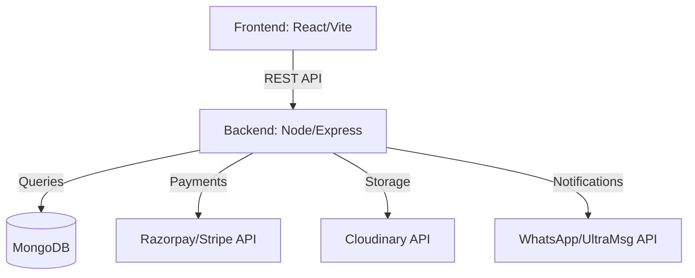

# GiftStore - Project Documentation & System Guide

Welcome to the official technical documentation for the **GiftStore** platform. This guide is designed for developers, system administrators, and stakeholders to understand the system architecture, setup procedures, and operational workflows.

---

## 1. System Architecture

GiftStore follows a modern MERN (MongoDB, Express, React, Node) architecture, ensuring scalability and performance.

### Data Flow Overview


- **Frontend**: A single-page application (SPA) built with React and styled with Tailwind CSS, utilizing Framer Motion for premium UI interactions.
- **Backend**: An Express.js REST API handling business logic, authentication, and third-party integrations.
- **Database**: MongoDB Atlas for flexible, document-oriented data storage.

---

## 2. Core Data Models

The system uses a highly relational structure within MongoDB to maintain data integrity.

- **User**: Stores authentication details, roles, profile info, and delivery addresses.
- **Product**: Contains details of items for sale, including pricing, categories, ratings, and vendor associations.
- **Bundle**: A collection of related products sold as a single package at a discounted rate.
- **Order**: Captures transaction details, customer shipping info, items purchased, and current status.
- **Vendor**: Extended profile for shop owners, including shop name, bio, and WhatsApp settings.
- **Coupon**: Defines discount codes, validity dates, and usage limits.
- **Review**: Customer feedback linked to specific products.

---

## 2. Security & Authentication

- **JWT (JSON Web Tokens)**: All authenticated requests use Bearer tokens stored in `localStorage`.
- **RBAC (Role-Based Access Control)**: Three distinct roles define system access:
    - `Customer`: Buy products, track orders, manage profile/addresses.
    - `Vendor`: Manage their own shop, products, bundles, and view shop-specific analytics.
    - `Admin`: Global system control, user management, global analytics, and master data management.
- **Bcrypt.js**: All user passwords are salt-hashed before being stored in the database.

---

## 3. Environment Configuration (.env)

### Backend Environment Variables

The backend requires a `.env` file in the `backend/` directory with the following keys:

```env
PORT=5000
MONGO_URI=your_mongodb_connection_string
JWT_SECRET=your_jwt_secret_here
CLIENT_URL=http://localhost:5173

# Cloudinary Configuration
CLOUDINARY_CLOUD_NAME=your_cloud_name
CLOUDINARY_API_KEY=your_api_key
CLOUDINARY_API_SECRET=your_api_secret

# Razorpay Configuration
RAZORPAY_KEY_ID=your_razorpay_key_id
RAZORPAY_KEY_SECRET=your_razorpay_key_secret
```

### Frontend Environment Variables

The frontend requires a `.env` file in the `frontend/` directory:

```env
VITE_API_URL=http://localhost:5000/api
```

---

## 4. Setup & Installation

### Prerequisites
- Node.js (v18+)
- MongoDB Atlas Account
- Cloudinary, Razorpay, and UltraMsg accounts (for full functionality)

### Installation Steps
1. **Clone the Repository**:
   ```bash
   git clone <repository-url>
   cd gift1
   ```
2. **Setup Backend**:
   ```bash
   cd backend
   npm install
   # Create .env and add your keys
   ```
3. **Setup Frontend**:
   ```bash
   cd frontend
   npm install
   ```

---

## 5. Database Initialization (Seeding)

To initialize the database with a master Administrator account:

```bash
cd backend
node seed.js
```

**Master Admin Credentials:**
- **Email**: `admin@example.com`
- **Password**: `123456`

> [!CAUTION]
> This account has full access to delete data. Change the password immediately via the profile settings after the first login.

---

## 6. Feature Deep-Dive

### Smart Order Tracking
A real-time tracking system with a dynamic timeline.
- **Data Model**: Orders transition through `pending` → `processing` → `shipped` → `delivered`.
- **UI Logic**: Automatically updates progress based on backend status changes.

### Vendor Analytics
Vendors have access to a custom dashboard showcasing:
- Total Sales & Revenue.
- Best Selling Products.
- Recent Order List.
- Performance over time.

### WhatsApp Notifications
The system sends automatic WhatsApp alerts to Vendors when a new order is placed, including customer details, order items, and shipping addresses.

---

## 7. Deployment Guide

### Backend (Process Management)
Use **PM2** to keep the backend running in production:
```bash
npm install -g pm2
pm2 start server.js --name giftstore-api
```

### Frontend (Static Build)
Generate the production-ready build:
```bash
cd frontend
npm run build
```
Deploy the resulting `dist/` folder to platforms like Netlify, Vercel, or a traditional Nginx server.

---

## 8. Troubleshooting FAQ

**Q: Images are not uploading.**
*A: Ensure your Cloudinary credentials in `.env` are correct and that the "Upload Preset" (if any) is configured.*

**Q: Payment window doesn't open.**
*A: Check that the RAZORPAY_KEY_ID is correct and your Razorpay account is in 'Live' or 'Test' mode accordingly.*

**Q: Email/Password login fails after seeding.**
*A: Ensure the `MONGO_URI` is correct and the `seed.js` script completed without errors.*

---

## 9. Maintenance & Support

### Periodic Database Scripts
The backend includes utility scripts for system maintenance:
- **Admin Seeding**: `node seed.js` (Initializes the master admin).
- **Password Reset Utility**: `node fixpasswords.js` (Resets all user passwords to `123456` - use only in emergencies).

### Contact & Support
For any technical issues or further customization requests, please contact development support at [support@giftstore.com](mailto:support@giftstore.com).
